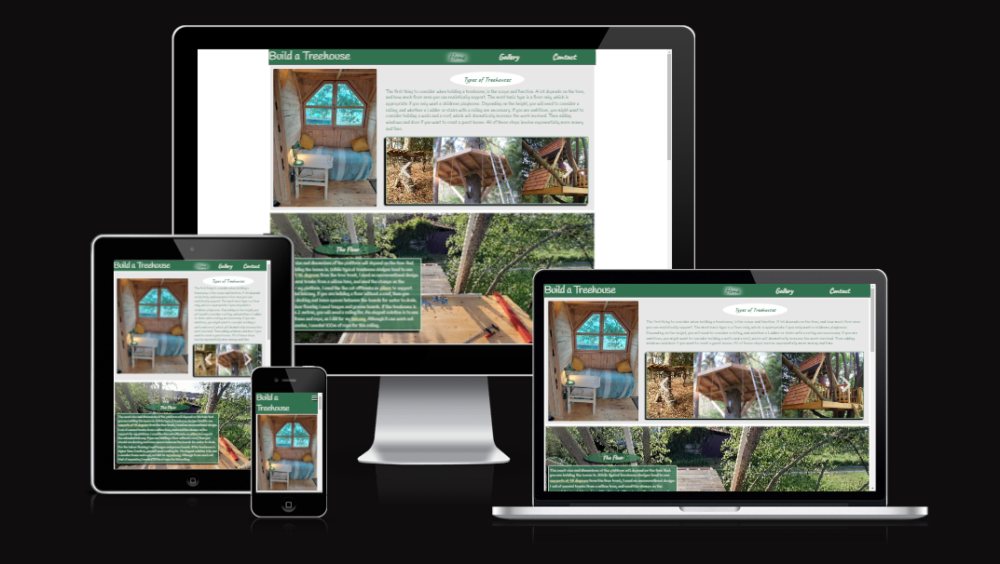
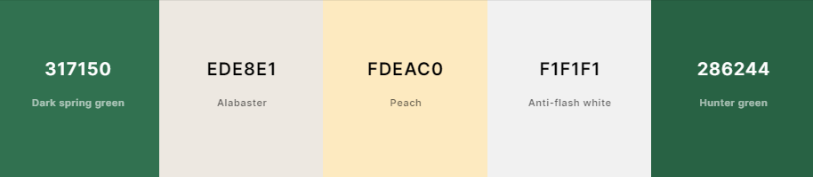
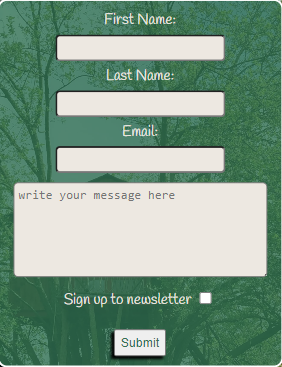
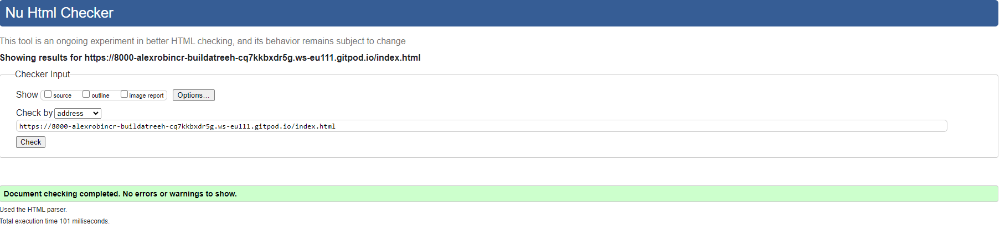
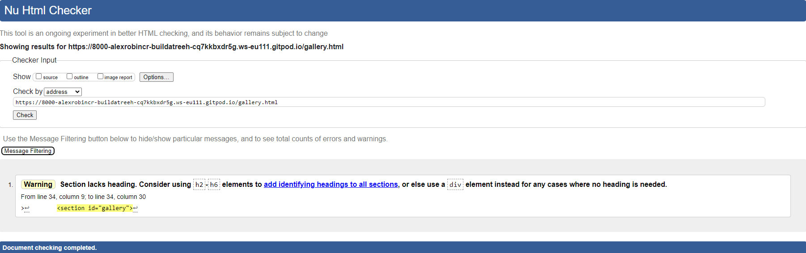
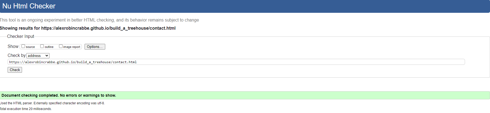

  

[Build a Treehouse](https://alexrobincrabbe.github.io/build_a_treehouse/) as the name indicates, is a site about how to build a treehouse. It is aimed at people who are interested in building a treehouse, and looking for ideas and inspiration, as well as a showcase for the website owner's work. The main feature is a brief guide to how to build a treehouse, which is complemented by photos that show examples of particular features. 

## Table of Contents
1. 

    
<a href="#ux">UX</a>

    <ul>
    <li>

    
<a href="#goals">Goals</a>

    - [Visitor Goals](#visitor-goals)
    - [Business Goals](#business-goals)
    - [User Stories](#user-stories)
    
</li>

    <li>

    
<a href="#visual-design">Visual Design</a>

    - [Wireframes](#wireframes)
    - [Fonts](#fonts)
    - [Icons](#icons)
    - [Colors](#colors)
    - [Images](#images)
    - [Styling](#styling)
    
</li>
    </ul>

2. 

    
<a href="#features">Features</a>

    <ul>
    <li>

    
<a href="#page-elements">Page Elements</a>

    - [All Pages](#all-pages)
    - [Index Page](#index-page)
    - [Gallery Page](#gallery-page)
    - [Contact Page](#contact-page)
    
</li>

    <li>

    
<a href="#additional-features">Additional Features</a>

    - [Image Loading Blur](#image-loading-blur)
    - [Email](#email)
    
</li>

    <li>

    
<a href="#feature-ideas">Feature Ideas</a>

    - [Basic](#basic)
    - [Content](#content)
    
</li>
    </ul>

3. 

    
<a href="#technologies-used">Technologies Used</a>

    - [Languages](#languages)
    - [Frameworks](#frameworks)
    - [Libraries](#libraries)
    - [APIs](#apis)
    - [Platforms](#platforms)
    - [Other Tools](#other-tools)

4. 

    
<a href="#testing">Testing</a>

    <ul>
    <li>

    
<a href="#methods">Methods</a>

    - [Validation](#validation)
    - [General Testing](#general-testing)
    - [Mobile Testing](#mobile-testing)
    - [Desktop Testing](#desktop-testing)
    
</li>

    <li>

    
<a href="#bugs">Bugs</a>

    - [Known Bugs](#known-bugs)
    - [Fixed Bugs](#fixed-bugs)
    
</li>
    </ul>

5. 

    
<a href="#deployment">Deployment</a>

    <ul>
    <li>

    
<a href="#local-deployment">Local Deployment</a>

    - [Local Preparation](#local-preparation)
    - [Local Instructions](#local-instructions)
    
</li>

    <li>

    
<a href="#github-deployment">Github Deployment</a>

    - [Github Preparation](#github-preparation)
    - [Github Instructions](#github-instructions)
    
</li>
    </ul>

6. 

    
<a href="#credit-and-contact">Credit and Contact</a>

    - [Content](#content)
    - [Contact](#contact)

----

# UX
## Goals
### Visitor Goals
The target audience for Build a Treehouse are:
- People who want are interest in building their own treehouse.
- People who are interested in seeing beautiful picture of things built by other people.
- People who want to share things they have built and exchange ideas with the website owner.

User goals are:
- Be inspired to build a treehouse.
- Get an idea of the steps in involved in building a treehouse.
- Contact the website owner, to share projects or get tips.
- Follow the progress of the website owner's treehouse.

Build a Treehouse fills these needs by:
- Providing a broad overview of the steps to build a treehouse on the home page.
- Providing external links to inspire and inform the visitor.
- Links in the text to the gallery, to show specific examples and show by example.
- Providing a contact page to write a message to the website owner, ask for more info, share their own ideas.

### Business Goals
The Business Goals of Build a Treehouse are:
- Provide a source of information about building a treehouse.
- Showcase the treehouse built by the website owner.
- Gain subscribers through the newsletter.
- Make contact with people with similar interests, exhange ideas.

### User Stories
1. As a user interested in making a treehouse, I expect to see different kind of treehouses.
2. I expect to see different stages of treehouse construction.
3. I expect to find information to inform me how I should build a treehouse.
4. I expect to be able to contact the website owner for more information and to have questions answered.
5. I would like to be able to follow the website owners progress in building a treehouse through the newsletter.

## Visual Design
### Wireframes

### Fonts

 

- The primary font [handlee](https://fonts.google.com/specimen/Handlee) was chosen to give a more informal feel to the website. It is used for the body of the text and the logo, because it is stylized, but still easy to read.

- The secondary font [caveat](https://fonts.google.com/specimen/Caveat) was chosen to compliment and contrast the primary font. It is used for the header, footer, and headings, but not for the logo, as I wanted the logo to stand out and be clear.

### Icons

  

- Icons are taken from the [Fontawesome](https://fontawesome.com/) Icon library and are utilised as classes in the `<i>` tag.
- Icons are utilised in the footer for links to external sites, the dropdown menus, and the back to top link.

### Colors

  

- The primary colour used for the site is rgb(49, 113, 80),a dark green,  which was chosen because of the treehouse theme. A darker shade was chosen for good contrast with the text.I used rgb for this color so that I could easily change the opacity.
- An off-white colour (#ede8e1) was chosen for the text, to contrast well with the background, while the hint of yellow/green compliments the green shades and softens the contract slightly.
- rgb(253 234 192) was chosen for the in text links to give contrast to both the background and the main text.
- A light grey (#f1f1f1) was used for some background elemnts to give them a slight contrast with lighter elements.
- Black and white were used for borders and shadows.

### Images

- All images used were my own, other than the mini-gallery on the home page. 

### Styling 

# Features
## Page Elements
### All Pages
#### Navbar

  

  

- The Navbar was based largely on the Love Running example. Other than the specific styling, a transition animation was added to the dropdown menu. 
- On larger screens the Navigation links are shown by default.
- The link to the current page is highlighted using combined text-shadow effects to create an aura effect.
- The Navbar is fixed and does not scroll with the rest of the content.

#### Footer

  

- The footer is styled similarly to the header
- However is not fixed, and is only visible when scrolling down.
- It contains links to external sites, with more information about treehouses for interested users.

### Index Page
#### Introduction

  
  

- The top section of the index page is an introduction, that gives and overview of the kinds of treehouses that can be built, any of which may apply to the intested user.

- The first image was chosen to be visually inviting, and immediately capture the interest of user visting the home page.

- Simpler styles were used for the mobile version, to clearly dileanate the sections.

##### Mini-Gallery

  

- The mini-gallery appears only on the screen for tablet screens or larger. It was added to add variety to the layour on larger screens, and utilize the screenspace. The border and shadow were added to make it stand out, as it is the only part of the site that uses images from external sources. Arrows were added to make it clear that this image is in a window that is scrollable. The scrollbars were removed for stylistic reasons.

- The Mini-Gallery is the only part of the sight that uses images from external sources.

##### Subsection links

  

- These only appear on the mobile version. They were added to allow users to quickly jump to sections without scrolling.

#### Floor, Stairs and Walls/Roof sections

  

  

- The images of the following sections show various stages of construction of a treehouse, and relate to the titles of each section. They were chosen to be both visually appealing, and informative.
- On larger screens the text for the following sections appears in front of the corresponding image for each subsection. This was done to make the page visually appealing on all screensizes, without leaving large sections of empty space.

#### Scroll to top button

  

- This only appears on the mobile view. It appears just above the footer at the end of the page. 
- It is overlaid on top of the content, to avoid blank space appearing between the content and the footer.

### Gallery Page

  

  

- The Gallery page contains images to specific parts of the treehouse.
- It is intended to be browsed, simply for people intested in seeing the images.
- It is also intended to be functional. Individual images are linked by words in the text on the main page. This allows users to see images that show more detail than is shown on the home page, if they are interested, without overcrowding the homepage with images.
- On larger screens the scroll direction was changed to horizontal. This was to allow several images to be shown screen at the same time, utilizing the whole screen and reducing the amount of scrolling. It also means that the the images can be scaled with a uniform height, and all fit entirely on the screen.
- On mobile view, the scroll to top button also appears.

### Contact Page

  

  

- The contact page contains a simple contact form, which allows users to contact the website owner and subcribe to a newsletter
- The form is reponsive to use space efficiently on mobile screens
- All fields must be filled out to submit the form, and the email field only accepts a vaid email format.

## Feature Ideas

### Content 
- In order to keep the scope of the project manageable, the instructions on the site were kept very brief. In practice much more detail should be included on building a tree house. This would include more expansive and specific sections
- A cost caculator, with the floor area and type of treehouse(with/without roof). Would likely need Javascript to implement.
- An extra page, listing tools and materials that are needed

# Technologies Used
## Languages
- [HTML](w3.org/standards/webdesign/htmlcss)
    * Page markup.
- [CSS](w3.org/standards/webdesign/htmlcss)
    * Styling.

## Libraries
- [Google Fonts](https://fonts.google.com)
    * Font Styles.
- [Fontawesome](https://fontawesome.com/)
    * Used for icons

## Platforms
- [Github](https://github.com/)
    * Storing code remotely and deployment.
- [Gitpod](https://gitpod.io/)
    * IDE for project development.

## Other Tools
- [Balsamiq](https://balsamiq.com/)
    * To create wireframes.
- [Favicon Generator](https://www.favicon.cc/)
    * Favicons
- [Reduce Images](https://www.reduceimages.com/)
    * Optimize images
- [Tinify](https://tinypng.com/)
    * Optimize images

----

# Testing
## Methods
### Validation

#### HTML

- HTML has been validated with [W3C HTML5 Validator](https://validator.w3.org/).

  
  
  

#### CSS

- CSS has been validated with [W3C CSS Validator](https://jigsaw.w3.org/css-validator/) 

    

#### Lighthouse

- Home Page (Desktop)

    

- Home Page (Mobile)

    

- Gallery Page (Desktop)

    

- Gallery Page (Mobile)

    

- Contact Page (Desktop)

   

- Contact Page (Mobile)

    

## Bugs

A bug was found: The image labels in the gallery showed in front of the header when scrolling.

    

The bug was fixed by changing the z-index of the image labels to be lower than the z-index of the header.

# Deployment

## Clone the Repository

1. Open a terminal in the folder you want to clone the project to.

2. In the terminal type "git clone https://github.com/alexrobincrabbe/build_a_treehouse" hit enter.

3. type "cd .\build_a_treehouse\" hit enter.

6. In the terminal type "git remote rm origin" hit enter.

5. On Github, create a new repository with a name of your choosing.

6. Type "git remote add origin $\lt$ url of your repository $\gt$" hit enter.

7. Type "git push --set-upstream origin main" hit enter.

## Deploy from Github

1. On Github, open the repository you made.

2. Open "settings" tab.

3. Click on "pages".

4. Under branch, select branch "main".

5. Click save.

6. Wait a few minutes, refresh the page.

7. The link to the deployed site will appear near the top of the page.