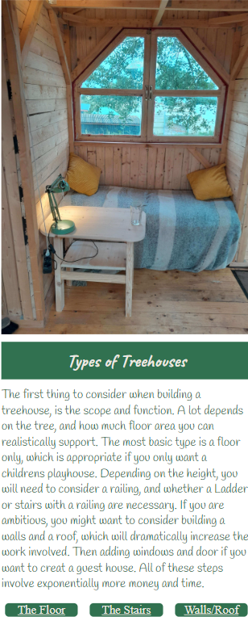
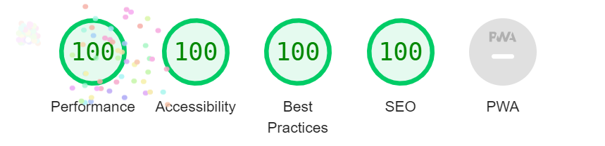
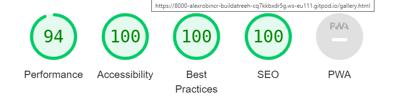
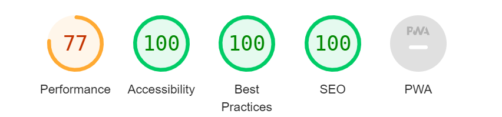

<div align="center">
  
</div>

[Build a Treehouse](https://alexrobincrabbe.github.io/build_a_treehouse/) as the name indicates, is a site about how to build a treehouse. It is aimed at people who are interested in building a treehouse, and looking for ideas and inspiration, as well as a showcase for the website owner's work. The main feature is a brief guide to how to build a treehouse, which is complemented by photos that show examples of particular features. 

## Table of Contents
1. <details open>
    <summary><a href="#ux">UX</a></summary>

    <ul>
    <li><details>
    <summary><a href="#goals">Goals</a></summary>

    - [Visitor Goals](#visitor-goals)
    - [Business Goals](#business-goals)
    - [User Stories](#user-stories)
    </details></li>

    <li><details>
    <summary><a href="#visual-design">Visual Design</a></summary>

    - [Wireframes](#wireframes)
    - [Fonts](#fonts)
    - [Icons](#icons)
    - [Colors](#colors)
    </ul>
</details>

2. <details open>
    <summary><a href="#features">Features</a></summary>

    <ul>
    <li><details>
    <summary><a href="#page-elements">Page Elements</a></summary>

    - [All Pages](#all-pages)
    - [Index Page](#index-page)
    - [Gallery Page](#gallery-page)
    - [Contact Page](#contact-page)
    </li>
    <li>

    [Feature Ideas](#feature-ideas)
    </li>

    </ul>
</details>

3. <details open>
    <summary><a href="#technologies-used">Technologies Used</a></summary>

    - [Languages](#languages)
    - [Libraries](#libraries)
    - [Platforms](#platforms)
    - [Other Tools](#other-tools)
</details>

4. <details open>
    <summary><a href="#testing">Testing</a></summary>

    <ul>
    <li><details>
    <summary><a href="#methods">Methods</a></summary>

    - [Validation](#validation)
    - [General Testing](#general-testing)
    - [Mobile Testing](#mobile-testing)
    - [Desktop Testing](#desktop-testing)
    </details></li>
    <li><details>
    <summary><a href="#bugs">Bugs</a></summary>

    - [Unfixed Bugs](#unfixed-bugs)
    - [Fixed Bugs](#fixed-bugs)
    </details></li>
    </li>
    </ul>
</details>

5. <details>
    <summary><a href="#deployment">Deployment</a></summary>

    - [Clone Repository](#local-preparation)
    - [Deploy from Github](#local-instructions)
    
</details>

6. <details>
    <summary><a href="#credits">Credits</a></summary>

    - [Images](#images)
    - [Code](#code)
    - [Tests](#tests)
    - [Readme](#readme)
</details>

----

# UX
## Goals
### Visitor Goals
The target audience for Build a Treehouse are:
- People who want are interested in building their own treehouse.
- People who are interested in seeing beautiful picture of things built by other people.
- People who want to share things they have built and exchange ideas with the website owner.

User goals are:
- Be inspired to build a treehouse.
- Get an idea of the steps involved in building a treehouse.
- Contact the website owner, to share projects or get tips.
- Follow the progress of the website owner's treehouse.

Build a Treehouse fills these needs by:
- Providing a broad overview of the steps to build a treehouse on the home page.
- Providing external links to inspire and inform the visitor.
- Links in the text to the gallery, to show specific examples and show by example.
- Providing a contact page to write a message to the website owner, ask for more info, share their own ideas.

### Business Goals
The Business Goals of Build a Treehouse are:
- Provide a source of information about building a treehouse.
- Showcase the treehouse built by the website owner.
- Gain subscribers through the newsletter.
- Make contact with people with similar interests, exchange ideas.

### User Stories
1. As a user interested in making a treehouse, I expect to see different kinds of treehouses.
2. I expect to see different stages of treehouse construction.
3. I expect to find information to inform me how I should build a treehouse.
4. I expect to be able to contact the website owner for more information and to have questions answered.
5. I would like to be able to follow the website owners' progress in building a treehouse through the newsletter.

## Visual Design
### Wireframes

Wireframes were made using [Balsamiq](https://balsamiq.com/wireframes).

<details>
<summary>Mobile Wireframes</summary>

- Home page

<div align="center">

</div>

- Gallery Page

<div align="center">

</div>

- Contact Page 

<div align="center">

</div>

</details>

<details>
<summary>Desktop Wireframes</summary>

- Home page

<div align="center">

</div>

- Gallery Page

<div align="center">

</div>

- Contact Page 

<div align="center">

</div>

</details>

### Fonts
<div align="left">

</div>
<div align="left">

</div>

<br>

- The primary font [handlee](https://fonts.google.com/specimen/Handlee) was chosen to give a more informal feel to the website. It is used for the body of the text and the logo, because it is stylised, but still easy to read.

- The secondary font [caveat](https://fonts.google.com/specimen/Caveat) was chosen to complement and contrast the primary font. It is used for the header, footer and headings, but not for the logo, as I wanted the logo to stand out and be clear.

### Icons
<div align="center">
  
</div>

- Icons are taken from the [Fontawesome](https://fontawesome.com/) Icon library and are utilised as classes in the `<i>` tag.
- Icons are utilised in the footer for links to external sites, the dropdown menus and the back to top link.

#### Favicon

<div align="center">
  
</div>

- The Favicon was designed using a [favicon generator](https://www.favicon.cc/). Original design used brown and green, but the colours were changed to match the website design. 

### Colors
<div align="center">
  
</div>

- The primary colour used for the site is RGB(49, 113, 80)(#317150) a dark green,  which was chosen because of the treehouse theme. A darker shade was chosen for good contrast with the text. I used rgb for this colour so that I could easily change the opacity.
- An off-white colour (#EDE8E1) was chosen for the text, to contrast well with the background, while the hint of yellow/green complements the green shades and softens the contrast slightly.
- RGB(253, 234, 192)(#FDEAC0) was chosen for the in text links to give contrast to both the background and the main text. 
- A light grey (#f1f1f1) was used for some background elements to give them a slight contrast with lighter elements. I used this instead of #EDE8E1 because it had a cleaner appearance.
- RGB(40, 98, 68)(#286244) was used specifically for the link to the current page. It is a slightly darkened shade of #317150. This had to be changed to increase the contrast with the background, for accessibility reasons.
- Black and white were used for borders and shadows.

# Features
## Page Elements
### All Pages
#### Navbar

<div align="center">
  
</div>
<div align="center">
  
</div>

- The Navbar was based largely on the Love Running example. Other than the specific styling, a transition animation was added to the dropdown menu. 
- On larger screens the Navigation links are shown by default.
- The link to the current page is highlighted using combined text-shadow effects to create an aura effect.
- The Navbar is fixed and does not scroll with the rest of the content.

#### Footer

<div align="center">
  
</div>


- The footer is styled similarly to the header, however is not fixed, and is only visible when scrolling down.
- It contains links to external sites, with more information about treehouses for interested users.

### Index Page
#### Introduction
<div align="center">
  
  
</div>

- The top section of the index page is an introduction that gives an overview of the kinds of treehouses that can be built, any of which may apply to the interested user.

- The first image was chosen to be visually inviting, and immediately capture the interest of user visting the home page.

- Simpler styles were used for the mobile version, to clearly deleanate the sections.

##### Mini-Gallery

<div align="center">
  
</div>

- The mini-gallery appears only on the screen for tablet screens or larger. It was included to add variety to the layout on larger screens and utilise the screenspace. The border and shadow were added to make it stand out, as it is the only part of the site that uses images from external sources. Arrows were added to make it clear that this image is in a window that is scrollable. The scrollbars were removed for stylistic reasons.

- The Mini-Gallery is the only part of the site that uses images from external sources.

##### Subsection links

<div align="center">
  
</div>

- These only appear on the mobile version. They were added to allow users to quickly jump to sections without scrolling.


#### Floor, Stairs and Walls/Roof sections

<div align="center">
  
</div>
<div align="center">
  
</div>

- The images of the following sections show various stages of construction of a treehouse, and relate to the titles of each section. They were chosen to be both visually appealing, and informative.
- On larger screens the text for the following sections appears in front of the corresponding image for each subsection. This was done to make the page visually appealing on all screensizes, without leaving large sections of empty space.

#### Scroll to top button

<div align="center">
  
</div>

- This only appears on the mobile view. It appears just above the footer at the end of the page. 
- It is overlaid on top of the content, to avoid blank space appearing between the content and the footer.

### Gallery Page

<div align="center">
  
</div>

<div align="center">
  
</div>


- The Gallery page contains images to specific parts of the treehouse.
- It is intended to be browsed, simply for people interested in seeing the images.
- It is intended to be functional. Individual images are linked by words in the text on the main page. This allows users to see images that show more detail than is shown on the home page, if they are interested, without overcrowding the homepage with images.
- On larger screens the scroll direction was changed to horizontal. This was to allow several images to be shown on the screen at the same time, utilising the whole screen and reducing the amount of scrolling. It also means that the images can be scaled with a uniform height and all fit entirely on the screen.
- On mobile view, the scroll to top button also appears.

### Contact Page

<div align="center">
  
</div>

<div align="center">
  
</div>

- The contact page contains a simple contact form, which allows users to contact the website owner and subcribe to a newsletter.
- The form is reponsive, so that space is used efficiently on mobile screens.
- All fields must be filled out to submit the form and the email field only accepts a valid email format.

## Feature Ideas

- In order to keep the scope of the project manageable, the instructions on the site were kept very brief. In practice much more detail should be included on building a tree house. This would include more expansive and specific sections
- A cost caculator, with the floor area and type of treehouse (with/without roof), would likely need Javascript to implement.
- An extra page listing tools and materials that are needed.

# Technologies Used
## Languages
- [HTML](w3.org/standards/webdesign/htmlcss)
    * Page markup.
- [CSS](w3.org/standards/webdesign/htmlcss)
    * Styling.

## Libraries
- [Google Fonts](https://fonts.google.com)
    * Font Styles.
- [Fontawesome](https://fontawesome.com/)
    * Used for icons

## Platforms
- [Github](https://github.com/)
    * Storing code remotely and deployment.
- [Gitpod](https://gitpod.io/)
    * IDE for project development.

## Other Tools
- [Balsamiq](https://balsamiq.com/)
    * To create wireframes.
- [Favicon Generator](https://www.favicon.cc/)
    * Favicons
- [Reduce Images](https://www.reduceimages.com/)
    * Optimize images
- [Tinify](https://tinypng.com/)
    * Optimize images
- [Image Resizer](https://imageresizer.com/)
    * Reduce image sizes


----

# Testing
## Methods
### Validation

#### HTML

- HTML has been validated with [W3C HTML5 Validator](https://validator.w3.org/).

<div align="center">
  
  
  
</div>

#### CSS

- CSS has been validated with [W3C CSS Validator](https://jigsaw.w3.org/css-validator/) 

<div align="center">
    
</div>

#### Lighthouse

- Home Page (Desktop)

<div align="center">
    
</div>

- Home Page (Mobile)

<div align="center">
    
</div>

- Gallery Page (Desktop)

<div align="center">
    
</div>

- Gallery Page (Mobile)

<div align="center">
    
</div>

- Contact Page (Desktop)

<div align="center">
   
</div>

- Contact Page (Mobile)

<div align="center">
    
</div>

#### Mobile Testing

- I tested the site on my android device. All pages and links worked correctly.

- On iOS the submit button on the contact page seems to have a minor issue:

<div align="center">
    
</div>

#### Desktop Testing

- I checked all pages and links on Chrome, Safari, Microsoft Edge, and Mozilla Firefox.

- No problems were found on Chrome, Safari, or Microsoft Edge.

- A problem was found on the gallery page in Mozilla Firefox (see [unfixed bugs](#unfixed-bugs)).

## Bugs

### Unfixed Bugs

- In Mozzilla Firefox, a bug was found on the gallery page. There is a large spacing between
gallery images. 

<div align="center">
    
</div>

- The source of the bug was determined to be the sizing of the image-container class divs.

 - I checked the size of the gallery container, which contain the divs, and the images and labels inside the divs to see if any of these were the causing the image containers to be resized, but all other elements had the correct sizing. 

- Shown below are the dimensions of the image containers.

<div align="center">
    
</div>

- The only way I could get the container width to change was by setting a fixed width, however since the images are different sizes, this was not a solution to the bug. 

- The sizing works correctly on all other browsers (Chrome, Edge, Safari).

### Fixed Bugs

- A bug was found: The image labels in the gallery showed in front of the header when scrolling.

<div align="center">
    
</div>

- The bug was fixed by changing the z-index of the image labels to be lower than the z-index of the header.

# Deployment

## Clone the Repository

1. Open a terminal in the folder you want to clone the project to.

2. In the terminal type:

    ```
      git clone https://github.com/alexrobincrabbe/build_a_treehouse
    ```

3. Change to the repository folder:

    ```
      cd .\build_a_treehouse\
    ```

6. Remove the origin:

    ```
      git remote rm origin"
    ```

5. On Github, create a new repository with a name of your choosing.

6. Add your Github repository to the origin:

    ```
      git remote add origin <url of your repository>
    ```

7. Push the files to your repository:

    ```
      git push --set-upstream origin main
    ```

## Deploy from Github

1. On Github, open the repository you made.

2. Open "settings" tab.

3. Click on "pages".

4. Under branch, select branch "main".

5. Click save.

6. Wait a few minutes, refresh the page.

7. The link to the deployed site will appear near the top of the page.

# Credits

## Images

All images on the site are photos taken by myself of a treehouse I built, with the exception of the Mini-Gallery images (which only features in the desktop version).

Image sources:

https://cdn.apartmenttherapy.info/image/upload/v1558432909/at/archive/5ba159856722b52e4c3be0545e70c1a37282623e.jpg

https://www.familyhandyman.com/wp-content/uploads/2019/05/FH12MAR_52_651_005-treehouse-building-tips-1.jpg

https://i.pinimg.com/736x/f5/ec/3b/f5ec3b5c87e410f437f42002f82ee563.jpg

https://www.pinterest.de/pin/548946642072268690/

https://d3emaq2p21aram.cloudfront.net/media/cache/venue_roundup_single_image/uploads/%200Regular_Roundup/Treehouse2017/Cindercone_05.jpg

## Code

The [Love Running](https://github.com/Code-Institute-Solutions/love-running-v3) project was used as a template for the header and footer in the html code.

## Tests

Thanks to Lewis for checking my site on his iPhone.

## Readme

The [readme](https://github.com/Ri-Dearg/horizon-photo/blob/master/README.md?plain=1) by Rory Patrick (mentor) was used as a template. 